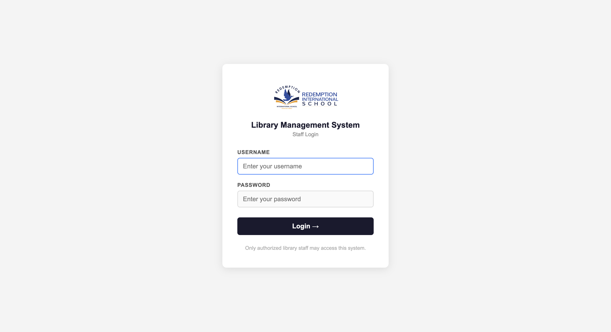
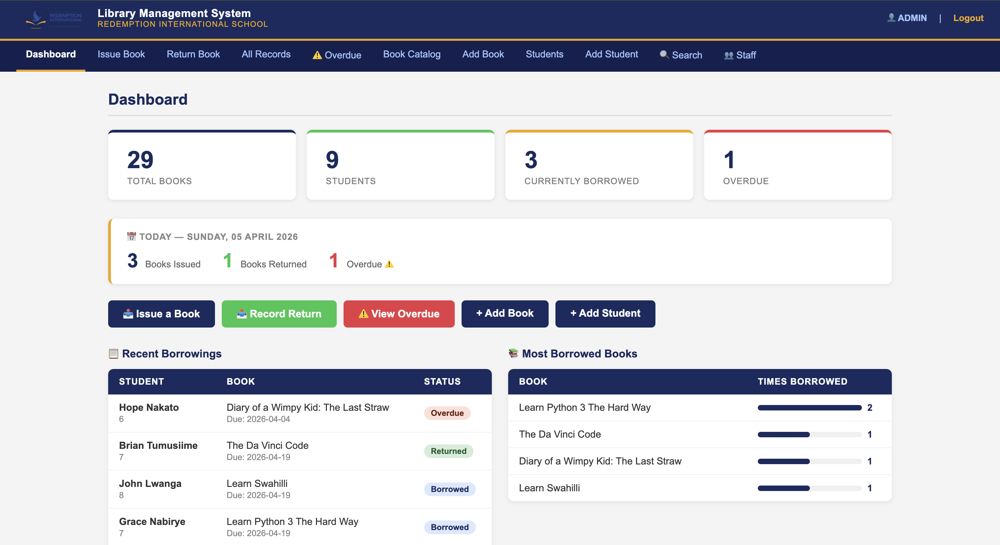
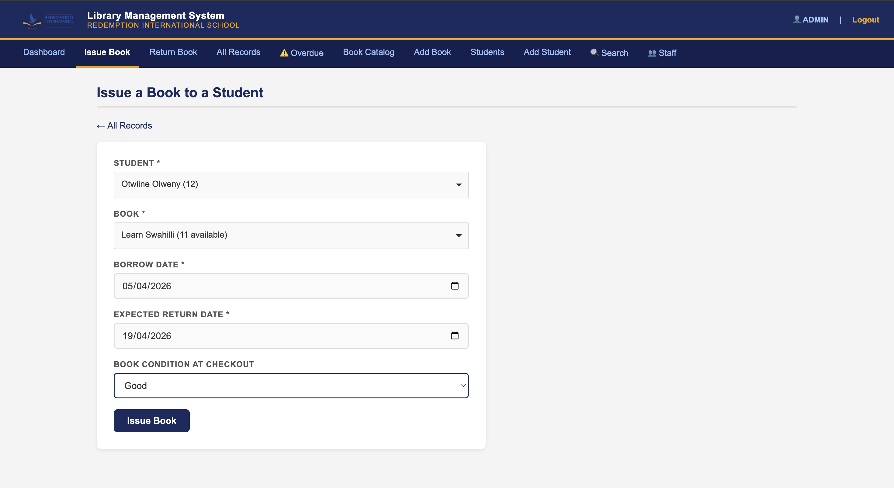
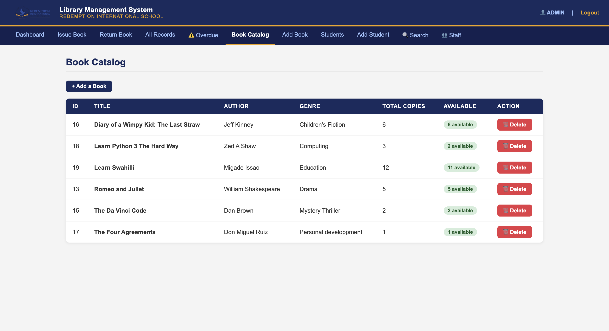
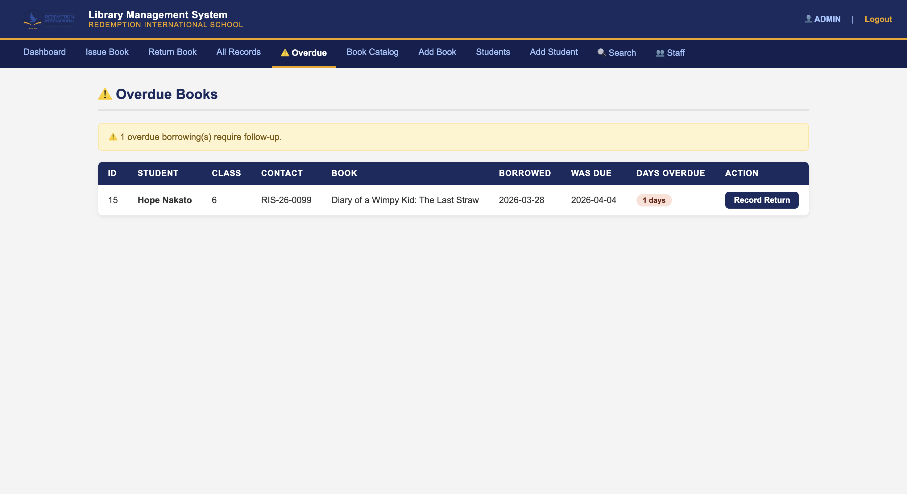
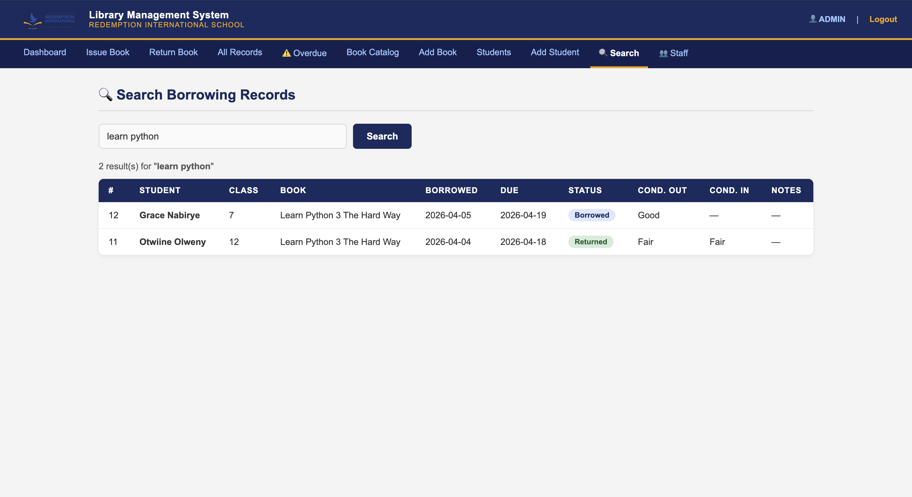

  

  # School Library Management System

  A complete, web-based library management system built for schools.
  Track books, manage borrowers, detect overdue returns, and eliminate
  lost resources — all from a simple browser interface.

  **Built and deployed by [Otwiine Jatel Olweny](https://github.com/Otwiine)**
  
  
  
  
  

---

##  Screenshots

### Login Page

### Dashboard

### Issue a Book

### Book Catalog

### Overdue Books

### Search Records

---

## Features

-  **Live Dashboard** — real-time stats on books, students, borrowings and overdue items
-  **Book Catalog** — add and manage your entire book inventory with copy tracking
-  **Student Profiles** — register students with class and ID number
-  **Issue Books** — searchable dropdowns, condition tracking at checkout
-  **Record Returns** — condition tracking on return eliminates disputes
-  **Overdue Detection** — automatic daily overdue report with days count and contact info
-  **Search** — find any record instantly by student name, book title, or class
-  **Staff Authentication** — secure login with hashed passwords, session management
-  **Multiple Staff Accounts** — admin controls, role-based access
-  **Safe Deletion** — books and students protected by active borrowing checks
-  **Security** — session expiry, back-button protection, no cached pages after logout

---

##  Built For Schools

This system was originally built for [**Redemption International School (RIS),
Kampala, Uganda**](https://redemptioninternationalschool.com/) to solve the problem of lost books, untracked borrowers,
and unresolvable condition disputes.

<!-- It is now available for deployment at other schools across Uganda and beyond. -->
It is in the final stages of development and will soon be  available for deployment at other schools across Uganda and beyond.

---

##  Get It For Your School

You do not need to install anything. The system is managed and hosted for you.

### What You Get
- Your school name and logo on the system
- A live URL your staff can access from any browser
- Staff accounts set up and ready
- Your existing book catalog entered into the system
- Staff training and walkthrough
- Ongoing technical support

### How It Works

Your school → contacts me → we set up → you go live within a few days

### Pricing
Pricing is flexible and agreed upon directly based on your school's size
and needs. I offer both one-time setup and monthly subscription options.

> 💬 **Reach out to discuss what works for your school.**

---

##  Contact

**Otwiine Jatel Olweny** — Developer & Deployment
-  Email: otwiine@gmail.com
-  Website: [Otwiine](https://otwiine.github.io/GeoPortfolio/)
-  X: [@Mr_OJO16](https://x.com/Mr_OJO16)
<!--
---

## 🛠️ Tech Stack

| Layer | Technology |
|---|---|
| Frontend | HTML, CSS |
| Backend | PHP 8.0+ |
| Database | MySQL 5.7+ |
| Server | Apache / Nginx |

---
-->

  © 2026 Otwiine Jatel Olweny. All rights reserved.

